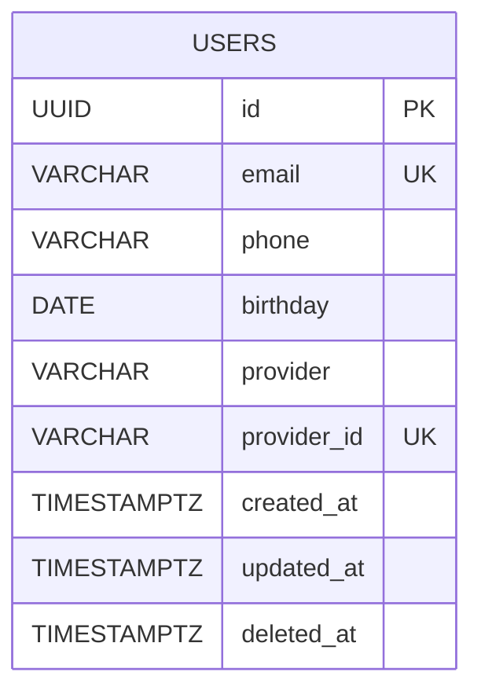
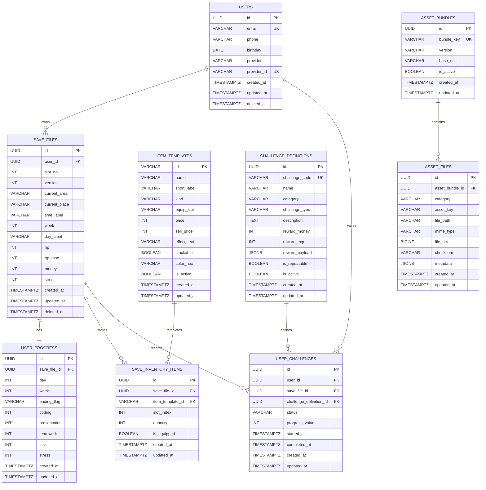

# PostgreSQL ERD Draft

이 문서는 현재 저장소 구현을 기준으로 PostgreSQL용 ERD 초안을 정리한 것이다.

## 1. 현재 코드 기준 확정 엔티티

- `users`: 실제 Flyway 마이그레이션과 JPA 엔티티가 존재
- `asset manifest`: 현재는 DB 테이블이 아니라 `asset-manifest.json` 파일 기반
- `save file`, `challenge`: 현재는 서버 DB 테이블이 없고 프런트 상태 또는 로컬 저장소 기반

## 2. 현재 구현 ERD

## 3. PostgreSQL 기준 권장 ERD

현재 프런트 코드에서 관리 중인 로그인 사용자, 인벤토리, 장비, HUD/진행 상태, 에셋 매니페스트, 도전과제 진행도를 기준으로 정규화한 구조다.

## 4. 테이블별 근거

### `users`

- 근거 파일
  - `BackEnd/src/main/resources/db/migration/V1__create_users.sql`
  - `BackEnd/src/main/java/com/example/gameinfratest/user/User.java`
- 인증 소스는 Keycloak JWT이며 `provider`, `provider_id`로 외부 인증 계정을 식별
- `deleted_at` 기준 소프트 삭제 사용

### `save_files`

- 근거 파일
  - `FrontEnd/ssafy-maker/src/core/managers/SaveManager.ts`
  - `FrontEnd/ssafy-maker/src/scenes/MainScene.ts`
- 현재는 `localStorage`에 단일 JSON 저장
- PostgreSQL 전환 시 세이브 슬롯 단위의 루트 테이블로 두는 것이 적합
- `current_area`, `current_place`, `time_label`, `week`, `day_label`, `hp`, `money`, `stress`는 `MainScene`의 HUD 상태에서 직접 확인 가능

### `user_progress`

- 근거 파일
  - `FrontEnd/ssafy-maker/src/features/progression/types.ts`
  - `FrontEnd/ssafy-maker/src/scenes/MainScene.ts`
- `day`, `week`, `ending_flag`, 능력치(`coding`, `presentation`, `teamwork`, `luck`, `stress`) 분리 저장
- 세이브 파일 1건당 진행 상태 1건으로 보는 것이 자연스러움

### `item_templates`, `save_inventory_items`

- 근거 파일
  - `FrontEnd/ssafy-maker/src/scenes/MainScene.ts`
- 현재 아이템 마스터는 코드 상수 `SHOP_ITEM_TEMPLATES` 로 존재
- DB 전환 시 아이템 정의와 세이브별 보유 아이템을 분리해야 확장 가능
- `slot_index`, `is_equipped`로 인벤토리/장착 상태 복원 가능

### `challenge_definitions`, `user_challenges`

- 현재 서버 구현은 없음
- 다만 사용자 요청 범위에 도전과제가 포함되어 있고, 향후 API 명세까지 만들 계획이면 분리 설계가 필요
- 정의 테이블과 사용자 진행 테이블을 분리해야 반복형/일회성 도전과제를 모두 처리 가능

### `asset_bundles`, `asset_files`

- 근거 파일
  - `BackEnd/src/main/resources/assets/asset-manifest.json`
  - `BackEnd/src/main/java/com/example/gameinfratest/service/AssetManifestService.java`
  - `BackEnd/src/main/java/com/example/gameinfratest/api/controller/AssetManifestController.java`
- 현재는 정적 JSON 매니페스트를 그대로 응답
- 운영 단계에서 에셋 버전 관리, 배포 이력, 체크섬 검증이 필요하면 DB 테이블화가 유리

## 5. PostgreSQL DDL 설계 시 권장 사항

- `users.email`, `users.provider_id` 는 unique index 유지
- `save_files(user_id, slot_no)` 에 unique 제약 추가
- `save_inventory_items(save_file_id, slot_index)` 에 unique 제약 추가
- `user_challenges(user_id, challenge_definition_id, save_file_id)` 는 중복 정책에 맞춰 unique 여부 결정
- enum 후보
  - `item kind`: `equipment`, `consumable`
  - `challenge status`: `locked`, `available`, `in_progress`, `completed`, `claimed`
- 자주 조회할 컬럼
  - `save_files.user_id`
  - `user_challenges.user_id`
  - `asset_files.asset_bundle_id`

## 6. 해석 주의사항

- 이 저장소에서 DB로 확정된 것은 현재 `users` 테이블뿐이다.
- 나머지 테이블은 현행 프런트 상태 구조와 정적 에셋 매니페스트를 PostgreSQL로 옮길 때의 권장안이다.
- 따라서 API 명세서를 만들 때는 `현재 구현 API` 와 `목표 API` 를 분리해서 작성하는 것이 맞다.
