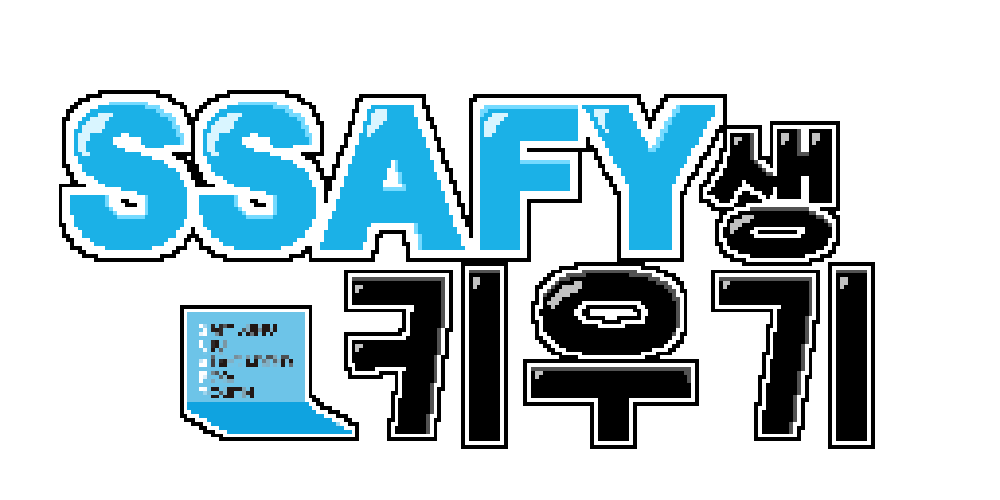

# 🎮 SSAFY생 키우기

<p align="center">
  
</p>

> SSAFY 1학기를 배경으로 한 2D 탑다운 육성 시뮬레이션 게임입니다.  
> 프론트엔드, 백엔드, 인증, 배포 인프라가 함께 맞물려 동작하는 통합 프로젝트입니다.

## 1. 프로젝트 소개

`SSAFY생 키우기`는 로그인부터 캐릭터 생성, 메인 월드 탐험, NPC 상호작용, 미니게임, 저장/불러오기, 엔딩 분기까지 하나의 플레이 루프로 설계된 웹 게임입니다.

- SSAFY 1학기를 배경으로 한 2D 탑다운 육성 시뮬레이션 게임
- 브라우저에서 동작하는 `Phaser 3` 기반 게임 클라이언트
- 백엔드 API, Keycloak 인증, Docker 기반 배포 인프라와 연동되는 실서비스 구조
- STG / PROD 분리, Blue-Green 배포, 운영 모니터링까지 고려한 팀 프로젝트

## 2. 컨셉 정리: "싸피생 키우기" 핵심 루프

### 한 줄 정의

**캐릭터를 생성**하고, 지도(캠퍼스/헬스장/로또방/상점 등)를 돌아다니며 스케줄을 보내 **능력치를 올려 다양한 엔딩**을 보는 육성 시뮬레이션 게임입니다.  
연애 루트도 포함되어 있습니다.

### 코어 루프

1. **캐릭터 생성**
2. **일정(하루/주차) 진행**: 지도에서 장소 선택, 행동력 소모
3. **능력치 변화 + 이벤트/랜덤 발생**
4. **중간 평가(프로젝트/발표/시험)** 를 통과하며 성장
5. **졸업/취업/프로젝트 결과**에 따라 엔딩 분기

## 3. 기획 배경 및 목적

이 프로젝트는 단순한 미니게임 모음이 아니라, 사용자의 플레이 선택과 능력치 변화가 결과에 반영되는 성장형 시뮬레이션을 목표로 합니다.

- 로그인 이후 사용자가 게임 세계에 진입
- 캐릭터를 생성하고 메인 스토리와 상호작용 진행
- 행동, 일정, 미니게임 결과가 능력치와 진행도에 반영
- 최종적으로 플레이 결과에 따라 서로 다른 엔딩으로 이어짐

즉, 이 프로젝트의 핵심 목적은 **게임적 재미**, **상태 저장이 가능한 서비스 구조**, **운영 가능한 웹 시스템**을 하나로 결합하는 데 있습니다.

## 4. 기술 스택

### Frontend

- `Phaser 3`
- `TypeScript`
- `Vite`
- `HTML5 Canvas`

### Backend

- `Java 25`
- `Spring Boot 4.0.3`
- `Spring Security`
- `OAuth2 Resource Server`
- `Spring Data JPA`
- `Spring Web MVC`
- `Spring WebSocket`
- `Flyway`
- `springdoc OpenAPI`

### Database / Cache / Messaging

- `PostgreSQL`
- `Redis`
- `RabbitMQ`

### Auth / Infra / Deployment

- `Keycloak`
- `Docker Compose`
- `Nginx`
- `Jenkins`
- `n8n`
- `Cloudflare`
- `AWS EC2`

### Monitoring

- `Prometheus`
- `Grafana`
- `Loki`
- `Promtail`
- `node-exporter`

## 5. 🧠 시스템 아키텍처 한눈에 보기

```text
Browser
  └─ Frontend (Phaser + TypeScript + Vite)
      ├─ Static assets (/)
      └─ API requests (/api)
             ↓
         Nginx Ingress
             ├─ PROD frontend live
             ├─ STG frontend live
             ├─ /api -> Spring Boot backend
             ├─ auth.ssafymaker.cloud -> Keycloak
             ├─ jenkins.ssafymaker.cloud -> Jenkins
             └─ n8n.ssafymaker.cloud -> n8n
                     ↓
                Spring Boot Backend
                  ├─ Auth / Session(BFF)
                  ├─ Save File / Inventory
                  ├─ Challenge
                  ├─ Death Dashboard
                  └─ Asset Manifest
                     ↓
          PostgreSQL / Redis / RabbitMQ
```

## 6. ✨ 주요 기능

- 🔐 Keycloak 기반 로그인 / 회원가입 / 세션 확인 / 로그아웃
- 🧑 캐릭터 생성 및 외형 선택
- 🗺️ 메인 월드 이동과 구역 전환
- 💬 NPC 상호작용 및 스토리 대사 진행
- 🎮 미니게임 플레이와 보상 획득
- 📈 능력치 및 진행도 반영
- 💾 저장 / 불러오기 / 인벤토리 관리
- 🏁 최종 요약 및 멀티 엔딩 분기
- 📊 공개 사망 기록 대시보드 API 연동

## 7. 🔎 심층 분석 요약

### Frontend 분석

프론트엔드는 `FrontEnd/ssafy-maker/src/app`, `FrontEnd/ssafy-maker/src/game`, `FrontEnd/ssafy-maker/src/features`, `FrontEnd/ssafy-maker/src/scenes`를 중심으로 구성됩니다.

- 진입점: `FrontEnd/ssafy-maker/src/app/main.ts`, `FrontEnd/ssafy-maker/src/app/game.ts`
- 씬 등록: `FrontEnd/ssafy-maker/src/app/registry/sceneRegistry.ts`
- 핵심 흐름:
  `BootScene` → `PreloadScene` → `LoginScene` → `StartScene` → `IntroScene` → `NewCharacterScene` → `MainScene` → 엔딩 씬들
- 메인 플레이 대부분은 `MainScene`이 담당
- HUD, 대화 UI, 저장, 진행도, 미니게임 관련 책임은 일부 별도 모듈로 분리
- 에셋은 `FrontEnd/ssafy-maker/public/assets/game` 아래에서 로드

프론트 관점에서 특히 중요한 점:

- `/api` 프록시를 통해 백엔드와 연결
- 인증은 프론트 단독 토큰 처리보다 **백엔드 BFF 세션 흐름**에 맞춰 설계
- 저장 데이터는 게임 상태와 연동되지만, 실제 영속화 책임은 백엔드 API가 담당

### Backend 분석

백엔드는 `Spring Boot` 기반 API 서버이며, 실제 코드상 다음 기능이 확인됩니다.

- 인증: `AuthController`
  - `/api/auth/login`
  - `/api/auth/signup`
  - `/api/auth/callback`
  - `/api/auth/session`
  - `/api/auth/logout`
- 사용자 정보: `UserController`
  - `/api/users/me`
- 저장 / 인벤토리: `SaveFileController`
  - `/api/users/{userId}/save-files`
  - `/api/save-files/{saveFileId}`
  - `/api/save-files/{saveFileId}/inventory`
- 챌린지: `ChallengeController`
  - `/challenges`
  - `/users/{userId}/challenges`
- 공개 대시보드: `PublicDeathRecordController`
  - `/api/public/deaths/recent`
  - `/api/public/deaths/ranking`
  - `/api/public/deaths/dashboard`
- 에셋 배포 정보:
  - `/api/public/assets/manifest`

보안 구조도 코드에서 확인됩니다.

- `SecurityConfig` 기준
  - `/api/public/**`, `/api/auth/**`는 공개 허용
  - 나머지 요청은 인증 필요
- JWT Resource Server를 사용하면서도
- `BffSessionAuthenticationFilter`를 통해 세션 기반 인증 흐름을 함께 운영

즉, 이 프로젝트의 백엔드는 단순 CRUD 서버가 아니라 **게임 클라이언트와 인증 서버(Keycloak) 사이를 연결하는 BFF 역할**까지 담당합니다.

### Infra / WORK_GUIDE 분석

루트의 `WORK_GUIDE.md`와 `docs-infra` 문서를 기준으로 실제 운영 구조를 확인했습니다.

- 운영 서버: AWS EC2 단일 인스턴스
- 프록시 / 엣지: Cloudflare + Nginx
- 앱 배포: Docker Compose
- 앱 구조:
  - `stg-app`
  - `prod-app`
  - `stg-data`
  - `stg-auth`
  - `ingress`
  - `docker(ops)`

실제 운영 도메인:

- `ssafymaker.cloud`
- `www.ssafymaker.cloud`
- `stg.ssafymaker.cloud`
- `auth.ssafymaker.cloud`
- `jenkins.ssafymaker.cloud`
- `n8n.ssafymaker.cloud`

실제 배포 특징:

- 프론트 정적 파일은 `live` 디렉터리로 서비스
- `/api`는 nginx가 Spring Boot 백엔드로 프록시
- 백엔드는 `api-blue`, `api-green` 두 컨테이너로 Blue-Green 배포
- Jenkins가 GitLab webhook을 받아 배포 수행
- 배포 결과는 n8n webhook으로 전달
- 운영 도구 UI는 whitelist 기반으로 보호

모니터링 스택:

- Prometheus
- Grafana
- Loki
- Promtail
- node-exporter
- docker-stats-exporter

## 8. ⚙️ 설치 및 실행 방법

### 프론트엔드 로컬 실행

#### 요구 사항

- `Node.js 20.x`
- `npm 10.x`

> 실제 프론트 실행 기준은 `FrontEnd/ssafy-maker/package.json` 과 `.nvmrc` 기준입니다.

#### 1. 저장소 클론

```bash
git clone <repository-url>
cd FrontEnd/ssafy-maker
```

#### 2. 의존성 설치

```bash
npm install
```

#### 3. 개발 서버 실행

```bash
npm run dev
```

- 기본 개발 서버: `http://localhost:5173`
- 기본 API 경로: `/api`
- 로컬 개발 시 `/api` 요청은 `http://localhost:8080` 으로 프록시됩니다.

#### 4. 환경 변수 예시

```env
VITE_API_BASE_URL=/api
VITE_ENABLE_DEBUG_SHORTCUTS=false
VITE_ENABLE_DEBUG_OVERLAY=false
VITE_ENABLE_DEBUG_WORLD_GRID=false
```

#### 5. 빌드

```bash
npm run build
```

빌드 시 함께 수행되는 검증:

- TypeScript 타입 검사
- 씬 레지스트리 검증
- 미니게임 구조 검증
- 게임 에셋 검증
- TMX 레이어 검증
- Authored story / Fixed event 검증

#### 6. 테스트 / 검증

```bash
npm run test
npm run validate
```

### 백엔드 로컬 실행

#### 요구 사항

- `Java 25`
- `Gradle Wrapper 9.3.1`
- PostgreSQL / Redis / RabbitMQ

#### 실행 예시

```bash
cd BackEnd
./gradlew build
./gradlew bootRun
```

백엔드 로컬 프로필 기준 주요 설정:

- `application-local.yml`
- 기본 포트: `8080`
- JWT Issuer, DB, Redis, RabbitMQ, Keycloak URL을 환경 변수로 주입

### 인프라 로컬/운영 실행 참고

주요 Compose 파일:

- `docker/compose.app.yml`
- `docker/compose.nginx.yml`
- `docker/compose.ops.yml`
- `docker/compose.auth.yml`

예시:

```bash
docker compose -p stg-app --env-file docker/.env.stg -f docker/compose.app.yml up -d
docker compose -p ingress -f docker/compose.nginx.yml up -d
docker compose -p docker --env-file docker/.env.ops -f docker/compose.ops.yml up -d
```

## 9. 📁 폴더 구조

```text
S14P21E206/
├─ FrontEnd/
│  └─ ssafy-maker/
│     ├─ public/assets/game/        # 런타임 에셋
│     ├─ src/app/                   # Phaser 부트스트랩, 게임 설정, 씬 등록
│     ├─ src/game/                  # 게임 씬, 매니저, 정의, 시스템
│     ├─ src/features/              # 인증, 저장, UI, 미니게임, 스토리 기능
│     ├─ src/scenes/                # 로그인/인트로/엔딩 등 상위 흐름 씬
│     ├─ scripts/                   # 검증 및 테스트 스크립트
│     └─ docs/                      # 프론트 문서
├─ BackEnd/
│  ├─ src/main/java/                # API, 서비스, 리포지토리, 보안 설정
│  ├─ src/main/resources/           # application profile, Flyway, assets
│  ├─ build.gradle                  # Spring Boot / Java 25 의존성
│  └─ compose.yaml                  # 백엔드 보조 실행 설정
├─ docker/                          # Compose 기반 배포 정의
├─ Infra/
│  ├─ infra/nginx/                  # ingress 설정
│  ├─ monitoring/                   # Prometheus/Grafana/Loki 설정
│  └─ n8n/workflows/                # 운영 자동화 워크플로
├─ docs-infra/                      # 운영 문서, Runbook, ENV, CI/CD
├─ jenkins/                         # Jenkinsfile 및 Jenkins 이미지 정의
├─ exec/                            # 포팅 매뉴얼
└─ WORK_GUIDE.md                    # 운영 작업 시작 가이드
```

## 10. 🛠️ 트러블슈팅 및 고민한 흔적

### 1. 문서 기준 버전과 실제 코드 기준 버전 차이

- 프론트 문서 일부에는 `Node.js 25.x / npm 11.x` 로 표기된 내용이 있습니다.
- 하지만 실제 `FrontEnd/ssafy-maker/package.json` 과 `.nvmrc` 기준은 `Node.js 20.x / npm 10.x` 입니다.
- 따라서 실행 환경은 문서보다 저장소 설정 파일 기준으로 맞춰야 합니다.

### 2. 한글 인코딩 깨짐 흔적

- 포팅 매뉴얼과 일부 코드/문서에서 한글이 깨진 흔적이 보입니다.
- 협업 문서와 게임 내 문자열을 수정할 때 `UTF-8` 유지가 중요합니다.

### 3. MainScene 중심 구조의 복잡도

- 프론트 런타임 핵심 로직이 `MainScene`에 집중되어 있습니다.
- UI, 저장, 진행도, 디버그 관련 책임을 별도 모듈로 분리 중이지만 여전히 핵심 결합도가 높은 편입니다.

### 4. 운영 도구의 공개/비공개 경계 설계

- Jenkins, n8n, Grafana, RabbitMQ UI는 모두 완전 공개가 아니라 whitelist 기반으로 보호됩니다.
- 단, Jenkins `/project/` 와 n8n `/webhook/` 경로는 자동화 연동을 위해 예외 처리됩니다.
- 이는 운영 편의성과 보안 경계를 함께 고려한 구조입니다.

### 5. Blue-Green 배포와 정적 파일 배포의 분리

- 백엔드는 `api-blue / api-green` 구조로 무중단 배포를 수행합니다.
- 프론트는 `releases / live` 디렉터리 구조를 통해 정적 파일 버전을 교체합니다.
- 즉, 프론트와 백엔드가 같은 “배포”를 하더라도 방식은 다르게 설계되어 있습니다.

## 11. 👥 팀 / 라이선스

### 팀

- SSAFY 팀 프로젝트
- 게임 프론트엔드, 백엔드, 인증, 인프라까지 함께 다루는 통합 서비스형 프로젝트

### 팀원 / 역할 / 담당 영역

| 이름 | 역할 | 담당 영역 |
| --- | --- | --- |
| 진종민 | 팀장, PM / Frontend | 프로젝트 리딩, 프론트엔드 |
| 김민수 | Infra | 인프라 |
| 김명진 | Backend | 백엔드 |
| 종효련 | Frontend, Art, Music | 프론트엔드, 아트, 음악 |
| 최연웅 | Frontend | 프론트엔드 |
| 하지우 | Frontend, AI | 프론트엔드, AI |

### 라이선스

- 현재 저장소 기준 별도 `LICENSE` 파일은 확인되지 않았습니다.
- 외부 공개 용도라면 라이선스 정책을 별도로 정리하는 것이 적절합니다.

## 12. 📚 참고 문서

- [프론트엔드 구현 맵](./FrontEnd/ssafy-maker/docs/FRONTEND_IMPLEMENTATION_MAP.md)
- [환경 설정 가이드](./FrontEnd/ssafy-maker/docs/conventions/ENVIRONMENT_SETUP.md)
- [게임 기획 문서](./FrontEnd/ssafy-maker/docs/game-design/README.md)
- [루트 작업 가이드](./WORK_GUIDE.md)
- [포팅 매뉴얼](./exec/PORTING_MANUAL.md)
- [운영 현재 상태](./docs-infra/00_CURRENT_STATE.md)
- [운영 명령 가이드](./docs-infra/01_OPERATIONS.md)
- [CI/CD 가이드](./docs-infra/02_CI_CD.md)
