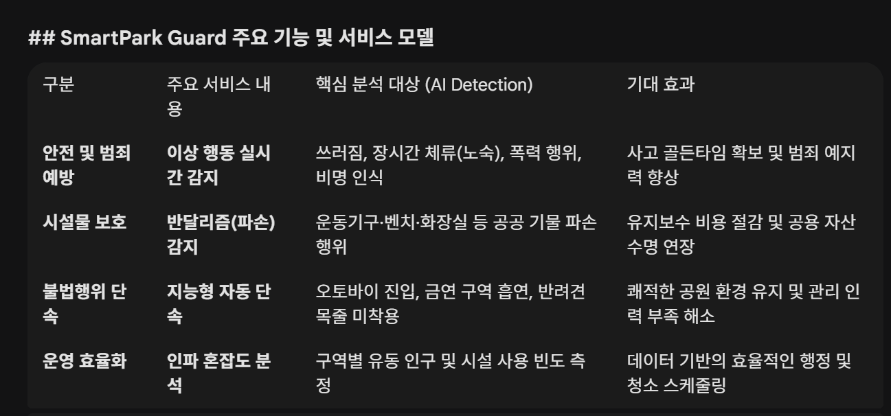
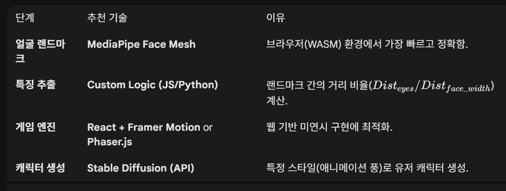

## 하지우

### [2026/02/23]

### 1. 기획 아이디어 탐구
#### 1.1 SmartPark Guard (AI 공원 통합 관제 솔루션)

**기획 의도 및 핵심 내용**

- **타겟/배경:** 지자체(공원관리과) 및 스마트시티 사업단 제안 타겟.
- **핵심 기능:** 공원 CCTV 영상 데이터를 딥러닝으로 분석하여 이상 행동(쓰러짐, 폭력 등), 기물 파손, 불법행위(오토바이 진입, 목줄 미착용 등)를 실시간 감지 및 혼잡도 분석.
- **차별화 포인트:** 실시간 비식별화(얼굴 마스킹) 기술을 적용해 프라이버시를 보호하는 안전한 감시 시스템 구축.
- *(참고: 화재 및 위험 구역 감시, 인파 밀집도 기반 스마트 가로등 제어 시나리오는 현재 기술/환경적 이유로 제외됨)*

**주요 서비스 내용**

**피드백 (리뷰)**

- 학습에 필요한 '이상 행동 영상 데이터셋'을 어떻게 확보할 것인지 구체적인 계획 부재.
- 다양한 이상 행동을 어떻게 명확히 분류하고 감지할 것인지에 대한 검토 필요.
- 야외 공원 특성상 발생할 수 있는 AI 인식률(정확도) 저하 우려.

**고도화 방안 (Action)**

- **프로세스 자동화:** 이상 감지 시 관리자 알람 송출 및 유관 기관 신고 자동 처리 도입.
- **보고서 생성:** 단순 알람에 그치지 않고, 상황 발생 내역에 대한 사후 보고서 자동 생성 기능 추가.
- **선택과 집중:** 구현할 여러 기능 중 우선순위를 명확히 잡아 핵심 서비스 Flow부터 고도화 진행.

>>>> 현실적으로 구현 난이도가 너무 높아 완성도에 의문이 들었음. (반려)

--------------------------------------------------------------------------------

### [2026/02/24]

#### 1. 기획 : 얼굴 유형 분석 미연시 게임 구현 시 예상되는 모델 설계의 어려움 분석 및 해결방안 모색

1. 예상되는 기술적 & 기획적 한계점

① 조명 및 환경에 따른 '데이터 오염'
문제: 사용자의 방 조명(역광, 노란 조명)이나 카메라 각도에 따라 동일인도 '강아지상'에서 '고양이상'으로 결과가 튈 수 있음. 이는 게임의 일관성을 해침.

해결: 온보딩 단계에서 **"가이드 라인(얼굴 실루엣)"**을 제시하고, MediaPipe의 Iris Tracking을 병행해 눈동자의 위치가 정중앙일 때만 캡처하도록 강제.

② 'FaceType' 분류의 모호함 (Hard Coding의 한계)
문제: 룰 기반(Rule-based) 결정트리는 명확하지만, "조금 날카로운 강아지상" 같은 중간 지대의 유저에게 불만족스러운 결과 제공 가능성.

해결: 기획안에 적어주신 '직접 선택(수정)' 기능 제공? (그리 와닿지 않는 해결방안, 좀 더 고민이 필요함) "AI는 당신을 [여우상]으로 보았지만, 본인이 생각하는 스타일로 조정하시겠습니까?"라는 과정을 통해 유저에게 통제권을 부여하는 방식.

③ 정적인 텍스트 위주의 '미연시' 한계
문제: 얼굴 분석은 첨단 기술인데, 정작 게임 플레이가 일반적인 텍스트 선택지 위주라면 유저가 "내 얼굴이 반영되고 있다"는 체감을 강하게 하기 어렵다고 판단.

해결: 미니게임 등이나 중간중간 게임의 하이라이트 부분에 사용자의 현재 표정을 기반하여 스토리에 영향을 미치는 지점을 추가하면 좀 더 다채로워지지 않을까 고려함.

2. AI 영상 기능을 접목할 고도화 포인트 (MVP+α)

- 단순히 '분류'에 그치지 않고, 게임 중간중간 실시간성을 부여할 수 있는 AI 접목 아이디어

① 실시간 표정 인식 기반 '호감도 보너스' (Emotion Detection)

내용: 대화 도중 유저가 실제로 웃으면 NPC의 호감도가 추가로 상승하거나, NPC가 무서운 이야기를 할 때 유저가 무표정이면 "겁이 없으시네요?" 같은 특수 대사 출력
기술: MediaPipe Face Mesh의 Blendshapes를 활용해 입꼬리 올라감, 눈 가늘어짐 등을 수치화하여 실시간 파라미터로 전송  ->  인식이 빠르게, 안정적으로 잘 될 지 걱정

② '나의 페르소나' AI 초상화 생성 (Diffusion Model)내용: 게임 시작 시 분석된 FaceType과 Tags를 프롬프트로 조합해, **"이 세계관 속 당신의 모습"**을 AI 일러스트로 생성
효과: 유저가 게임 속 주인공에 훨씬 더 몰입하게 되며, 결과 리포트에서 공유하기 좋은 '비주얼 요소'가 될 수 있음  ->  엔딩 컷신 영상 제작으로 대체

③ 립싱크 및 TTS를 활용한 실시간 대사 (Lip-Sync AI)내용: 텍스트만 나오는 것이 아니라, NPC가 내 얼굴 특징을 언급할 때 실제 목소리(TTS)와 입모양(SadTalker 등 라이트한 모델)이 일치하게 움직이게 함
효과: 6주 차 고도화 단계에서 시도해볼 만하며, 시각적 완성도를 극대화  ->  솔직히 그렇게 땡기지 않음.

3. 기술 스택 및 파이프라인 탐색

--------------------------------------------------------------------------------

### [2026/02/25]

# AI 특화 프로젝트 실습 정리 (Text-to-SQL 모델 최적화 및 서빙)

## 1. 실습 개요
본 프로젝트는 거대 언어 모델(LLM)을 활용하여 Text-to-SQL 태스크를 수행하는 소형 모델(Student Model)을 구축하고, 이를 효율적으로 학습 및 추론(Serving)하는 전체 파이프라인을 경험하는 실습입니다. 총 4개의 단계(Skeleton)로 구성되어 있으며, 데이터 생성부터 파인튜닝, 양자화, 그리고 고속 추론까지 최신 LLM 엔지니어링 기법들을 순차적으로 학습했습니다.

## 2. 각 폴더별 실습 내용 및 `.ipynb`의 역할

### 1) skeleton01: 지식 증류(Distillation)와 Pseudo Labeling
- **핵심 주제**: Teacher Model을 활용한 학습 데이터 생성
- **`LLM_기반_데이터_생성.ipynb`의 역할**: 
  - 정답(Gold label)이 없는 데이터에 대해 거대 모델(Upstage Solar API)을 Teacher Model로 사용하여 정답을 생성하는 Pseudo Labeling을 수행합니다.
  - 프롬프트 엔지니어링을 통해 Text-to-SQL 태스크에 맞는 고품질의 데이터를 생성하고, 이를 Student Model 학습을 위한 데이터셋으로 구축하는 과정을 실습했습니다.

### 2) skeleton02: LoRA 파인튜닝 (PEFT)
- **핵심 주제**: 생성된 데이터를 활용한 파라미터 효율적 미세 조정(PEFT)
- **`PEFT_Text2SQL.ipynb`의 역할**:
  - skeleton01에서 생성한 데이터셋을 불러와 EDA 및 전처리를 수행합니다.
  - Base 모델의 원래 능력을 유지하면서 Text-to-SQL 태스크에 최적화하기 위해 LoRA(Low-Rank Adaptation) 기법을 적용하여 모델을 파인튜닝합니다. 적은 GPU 메모리 자원으로도 효율적으로 모델을 학습시키는 방법을 다룹니다.

### 3) skeleton03: 양자화(Quantization)와 QLoRA
- **핵심 주제**: 모델 경량화 및 메모리 효율적 학습
- **`QLoRA.ipynb`의 역할**:
  - `bitsandbytes` 라이브러리를 활용하여 Base 모델을 4-bit 자료형으로 양자화(Quantization)하여 불러옵니다.
  - 모델의 용량과 VRAM 사용량을 획기적으로 줄이면서도 성능 하락을 최소화하는 QLoRA 기법을 적용하여 Text-to-SQL 모델을 학습하는 과정을 실습했습니다.

